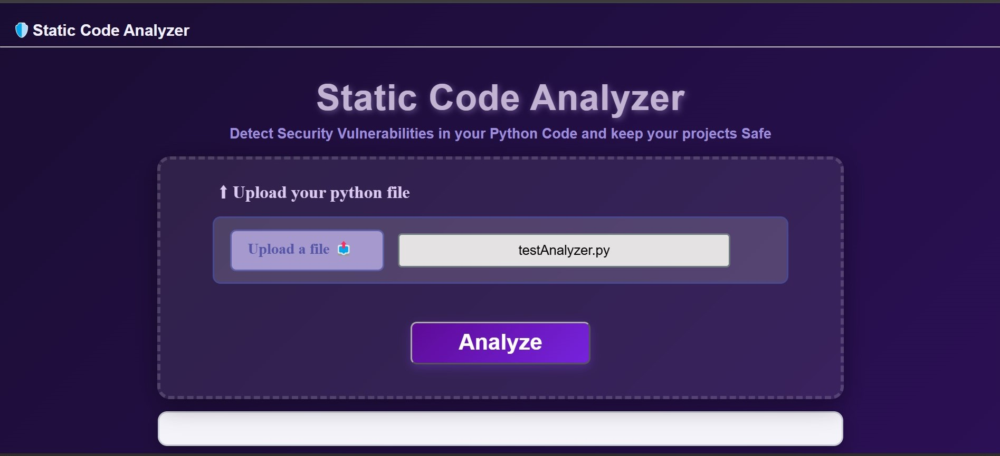
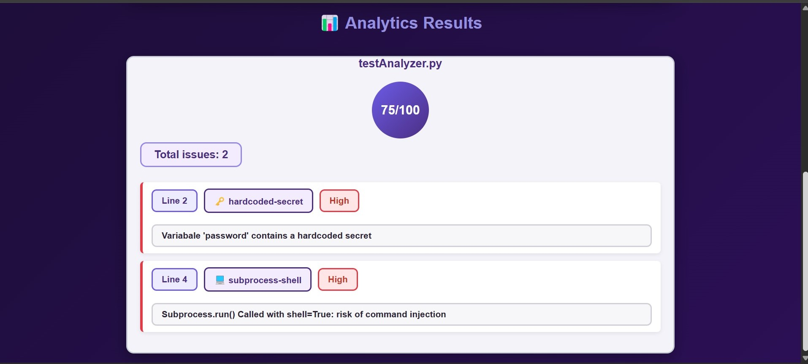

# 💬 Static Code Analyzer — A Chat-Style README

> *A README written as a conversation. Because why should documentation be boring?*

---

👤 User: Hey! What is this project?

🧑‍💻 Developer: Glad you asked! This is a Static Code Analyzer — a web tool built with FastAPI that analyzes a Python file you upload and detects 5 security vulnerabilities:

👤 User: Which vulnerabilities exactly?

🧑‍💻 Developer: Here's the list:

| # | Rule | Detects |
|---|------|---------|
| 1 | Eval/Exec Misuse | Unsafe use of eval() / exec() |
| 2 | Subprocess Shell Injection | Shell injection risks in subprocess calls |
| 3 | Pickle Deserialization | Unsafe pickle.load() usage |
| 4 | SQL Injection | String-formatted SQL queries |
| 5 | Hardcoded Secrets | API keys, passwords, and tokens embedded in code |

---

👤 User: Cool! What else can it do?

🧑‍💻 Developer: Three more things:

- 💾 Saves results to a database — filename, score, and detected issues
- 🎯 Calculates a code health score based on the severity of detected issues
- 📊 Shows everything on an interactive dashboard in real time, directly from the API response

👤 User: What did you build it with?

🧑‍💻 Developer:

- Backend: Python, FastAPI, SQLAlchemy, SQLite
- Frontend: HTML, CSS, JavaScript
- Testing: pytest

---

👤 User: Show me the project structure.

🧑‍💻 Developer: Here you go:

├── backend
│   ├── __init__.py
│   ├── main.py
│   ├── models.py
│   └── scoring.py
├── dashboard
│   ├── index.html
│   ├── script.js
│   └── style.css
├── rules
│   ├── __init__.py
│   ├── eval_exec_rule.py
│   ├── hardcoded_secret_rule.py
│   ├── pickle_load_rule.py
│   ├── sql_injection_rule.py
│   └── subprocess_shell_rule.py
├── tests
│   ├── test_eval_exec.py
│   ├── test_hardcoded_secret.py
│   ├── test_pickle_load.py
│   ├── test_sql_injection.py
│   ├── test_subprocess_shell.py
│   └── test_uploadFile.py
├── .gitignore
└── requirements.txt
---

👤 User: Alright, how do I run it?

🧑‍💻 Developer: Five easy steps:

1️⃣ Clone the repository:
git clone https://github.com/wahiba-labrini/static-code-analyzer.git
cd static-code-analyzer
2️⃣ Create and activate a virtual environment:
python -m venv venv
venv\Scripts\Activate.ps1
3️⃣ Install the dependencies:
pip install -r requirements.txt
4️⃣ Run the FastAPI server:
uvicorn backend.main:app --reload
**5️⃣ Open dashboard/index.html in your browser** — just make sure the server from step 4 is still running in the background.

👤 User:r:** Any screenshot?

🧑‍💻 Developer:** Of course! Here's what the tool looks like in action  📸

## 📸 Preview

**Uploading a file for analysis:**

**Analysis results on the dashboard:**

---

## 📚 Behind the scenes: Lessons Learned & Challeng👤 User:r:** Building this must have been smooth, righ🧑‍💻 Developer:r:** Haha, not exactly. Let me tell you the war stories 😅

### 1️⃣ Using pytest to discover rule limitations
I wrote pytest tests to validate each detection rule. Initial4 tests faileded**, which revealed real limitations in my rules — like missing detection when functions were imported directly, e.g. from subprocess import run. This pushed me to improve the rules' logic.

### 2️⃣ Debugging a 500 server error
I faced a 500 Internal Server Error in the /analyzer endpoint in main.py. Debugging it manually through the API tookentire dayay** with no results. Then I isolated the issue in a dedicated pytest test (test_uploadFile.py) and found the root causeunder 20 minuteses**: I had written issue instead of issues as a dictionary key.

>Lesson learned:d:** isolating bugs in small, focused tests beats debugging through the full application stack.
### 3️⃣ Debugging the scoring calculation
The score calculation was producing incorrect results. I added print statements for each rule's score deduction and discovered that the rule_id values didn't match between the rules and the scoring weights dictionary — a simple naming mismatch that silently broke the calculation.

### 4️⃣ Dashboard results not displaying
The analysis results weren't appearing in the dashboard, even though the same HTML was rendering correctly. After reviewing all the code, I found the culprit in style.css: a generic span selector was unintentionally overriding the styling of the newly added result elements.

---

## ⚠️ Honest talk: Known Limitations

👤 User: Nothing's perfect. What are the limitations?

🧑‍💻 Developer: Fair question:

- The tool analyzes one Python file at a time — no multi-file or project-wide analysis yet
- Detection rules may produce false positives or false negatives in some edge cases (e.g. dynamic code patterns)
- The current scoring weights are strict and may need calibration for typical codebases

---

## 🔮 What's next? Future Improvements

👤 User: Any plans for the future?

🧑‍💻 Developer: Absolutely! Here's my roadmap:

- [ ] Improve the limitations of the current detection rules (reduce false positives/negatives)
- [ ] Add more security detection rules
- [ ] Enhance the dashboard with charts (Chart.js) for statistics
- [ ] Support analyzing an entire project (multiple Python files) instead of a single file
- [ ] Add support for pasting code directly instead of only file upload
- [ ] Integrate Machine Learning
- [ ] Multi-language interface support
   

👤 User: Wait, Machine Learning? How would that work?

🧑‍💻 Developer: The goal is to eventually extend the rule-based analyzer with a machine learning component.

- 🧠 Train a model on labeled examples of vulnerable and non-vulnerable Python code
- 🔍 Extract relevant features from source code or its AST representation
- 🤝 Combine ML predictions with the existing security rules
- 📉 Evaluate whether the model can help reduce false positives and detect patterns that are difficult to capture with fixed rules
- 📊 Compare the ML-based approach with the current rule-based approach using a dedicated test dataset

«Note: ML integration is planned for a future version. The current analyzer relies entirely on AST-based static analysis and does not use machine learning.»
---

👤 User: Thanks for the tour!

🧑‍💻 Developer: Anytime! Happy analyzing! 🔍

---

Built with ❤️ by <a href="https://github.com/wahiba-labrini">Wahiba Labrini</a>
